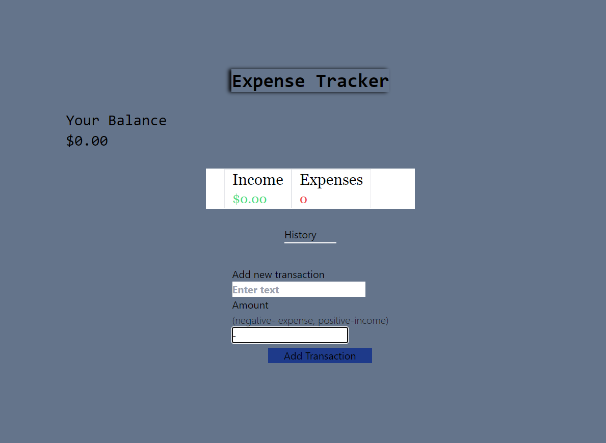

Expense Tracker
A simple, easy-to-use expense tracker built with React that helps you manage your finances effectively. This app allows you to:

Add and track income and expenses
View your transaction history
Get a clear breakdown of your balance, total income, and total expenses
The app uses React's Context API for global state management and Tailwind CSS for styling, providing a clean and responsive user interface. Perfect for anyone looking to gain better control over their personal finances with minimal effort.

